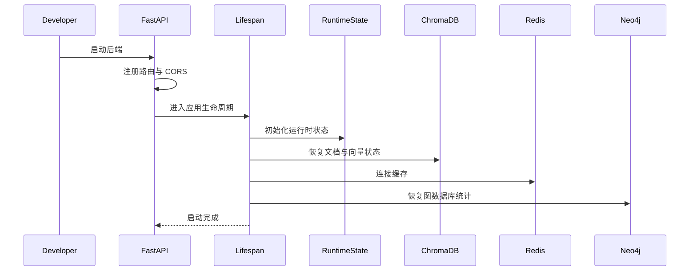
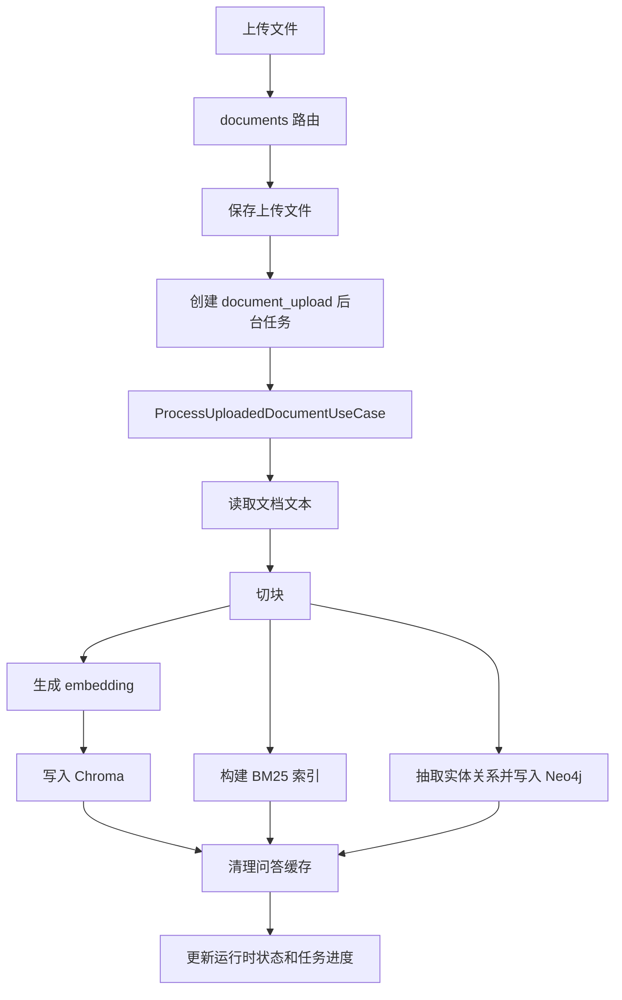
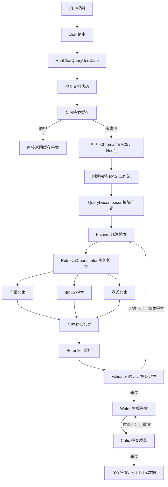
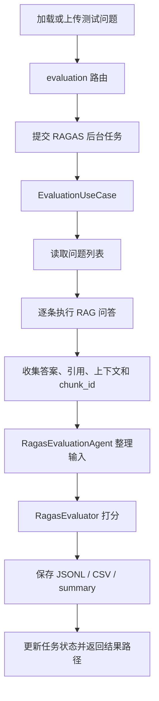
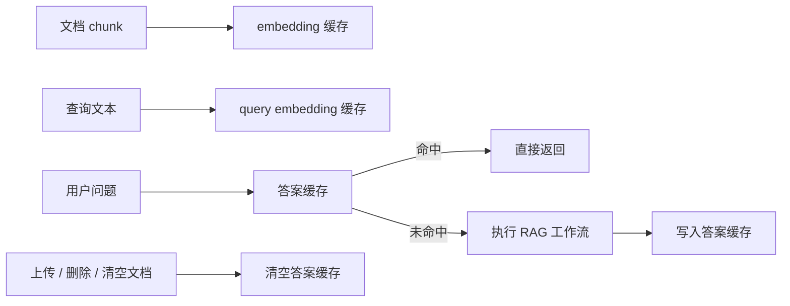

# Multi-Agent RAG 项目学习文档

这是一个基于 `FastAPI + Vue 3 + Multi-Agent RAG + ChromaDB + Neo4j + Redis + RAGAS` 的智能文档问答系统。它支持文档上传、自动切块、向量检索、BM25 关键词检索、知识图谱检索、多 Agent 协作问答、Redis 缓存、对话导出、文档预览和 RAGAS 评估。

你可以把系统理解成三条主线：

```text
上传文档 -> 切块 -> embedding -> 写入 Chroma / BM25 / Neo4j
用户提问 -> 多路检索 -> 多 Agent 协作 -> 生成答案、引用和工作流元数据
评估任务 -> 加载测试问题 -> 批量问答 -> RAGAS 打分 -> 输出评估文件
```

## 技术架构

| 层级 | 技术 | 作用 |
| --- | --- | --- |
| 前端 | Vue 3 + Vite + TypeScript + lucide-vue-next | Web 交互界面，负责文档上传、对话、引用展开、评估、统计和性能查看 |
| 后端 API | FastAPI + Uvicorn | 提供 HTTP 接口，承接前端请求 |
| 配置管理 | Pydantic Settings + `.env` | 统一读取模型、Neo4j、Redis、Chroma、路径和运行参数 |
| LLM | DashScope OpenAI-compatible API，默认 `qwen3.6-plus` | Agent 规划、验证、写作、批判和评估辅助 |
| 向量嵌入 | DashScope Embedding，默认 `text-embedding-v4` | 将文档块和查询文本转换为语义向量 |
| Agent 编排 | LangChain + LangGraph | 连接多个 Agent，形成有状态 RAG 工作流 |
| 多 Agent | QueryDecomposer / Planner / RetrievalCoordinator / Reranker / Validator / Writer / Critic / RagasEvaluationAgent | 拆解问题、规划检索、融合多路结果、重排、验证证据、生成答案、检查质量和整理评估输入 |
| 向量数据库 | ChromaDB | 持久化保存文档向量和 chunk 元数据 |
| 关键词检索 | rank-bm25 | 提供 BM25 精确关键词检索能力 |
| 知识图谱 | Neo4j + spaCy | 抽取实体关系，支持图谱检索和图数据库统计 |
| 缓存 | Redis | 缓存 embedding、query embedding、问答结果和性能统计 |
| 评估 | RAGAS | 评估回答忠实度、相关性、上下文精确率和召回率 |
| 异步任务 | TaskRegistry | 跟踪上传、问答、评估等后台任务进度 |
| 数据目录 | `data/` + `outputs/` | 保存上传文件、索引、Chroma 数据、BM25 索引、评估输入和评估输出 |

## 目录结构

```text
.
+-- src/
|   +-- server/        FastAPI 应用入口、路由、请求/响应模型、运行时状态和依赖装配
|   |   +-- routes/     documents、chat、data、evaluation、system 等 HTTP 路由
|   |   +-- utils/      lifespan、tasks、metrics、paths、runtime、dependencies 等基础设施
|   +-- use_cases/     应用用例：文档、聊天、评估、系统状态
|   +-- agents/        多 Agent 角色实现
|   +-- workflows/     LangGraph 工作流与工厂
|   +-- retrieval/     向量检索、BM25、图谱检索、调试工具
|   +-- ingestion/     文档加载、切块、embedding（入库前处理层）
|   +-- graph/         Neo4j 图谱存储、实体抽取、关系抽取
|   +-- storage/       Chroma 存储与工厂
|   +-- cache/         Redis 缓存服务
|   +-- evaluation/    RAGAS 和简单评估逻辑
|   +-- models/        核心数据模型
|   +-- utils/         日志、异常、LLM 内容处理、持久化恢复、workflow trace
+-- web/              Vue 3 前端项目，当前被 `.gitignore` 忽略
+-- scripts/          辅助脚本，目前包含测试问题生成脚本
+-- tests/            后端、检索、缓存、评估和工作流测试
+-- data/             上传文件、测试问题、Chroma 数据、BM25 索引
+-- outputs/          RAGAS 评估输出
+-- docker-compose.yml
+-- requirements.txt
+-- DESIGN.md
```

## 启动流程



关键文件：

- [src/server/main.py](/D:/python/Agent/Multi-Agent-RAG/src/server/main.py)：FastAPI 应用入口。
- [src/server/utils/lifespan.py](/D:/python/Agent/Multi-Agent-RAG/src/server/utils/lifespan.py)：启动和关闭时的恢复逻辑。
- [src/server/utils/dependencies.py](/D:/python/Agent/Multi-Agent-RAG/src/server/utils/dependencies.py)：全局依赖和用例装配。
- [src/server/utils/state.py](/D:/python/Agent/Multi-Agent-RAG/src/server/utils/state.py)：运行时状态。
- [src/server/utils/tasks.py](/D:/python/Agent/Multi-Agent-RAG/src/server/utils/tasks.py)：后台任务注册、进度和结果查询。

## 文档上传流程

接口：

```text
GET    /api/documents
POST   /api/documents
DELETE /api/documents/{name}
GET    /api/documents/{name}/preview
```

支持上传格式：`pdf`、`docx`、`txt`。



主要代码：

- [src/server/routes/documents.py](/D:/python/Agent/Multi-Agent-RAG/src/server/routes/documents.py)
- [src/use_cases/document.py](/D:/python/Agent/Multi-Agent-RAG/src/use_cases/document.py)
- [src/ingestion/document_loader.py](/D:/python/Agent/Multi-Agent-RAG/src/ingestion/document_loader.py)
- [src/ingestion/flat_chunker.py](/D:/python/Agent/Multi-Agent-RAG/src/ingestion/flat_chunker.py)
- [src/ingestion/embedder.py](/D:/python/Agent/Multi-Agent-RAG/src/ingestion/embedder.py)
- [src/storage/chroma_store.py](/D:/python/Agent/Multi-Agent-RAG/src/storage/chroma_store.py)

## 查询问答流程

接口：

```text
GET    /api/chat/messages
POST   /api/chat/messages
POST   /api/chat/tasks
DELETE /api/chat/messages
GET    /api/chat/export
GET    /api/tasks/{task_id}
```

`POST /api/chat/messages` 是同步问答接口，适合调试；`POST /api/chat/tasks` 是前端默认使用的异步接口，先返回 `task_id`，再通过 `/api/tasks/{task_id}` 轮询进度。



主要代码：

- [src/server/routes/chat.py](/D:/python/Agent/Multi-Agent-RAG/src/server/routes/chat.py)
- [src/use_cases/chat.py](/D:/python/Agent/Multi-Agent-RAG/src/use_cases/chat.py)
- [src/workflows/factory.py](/D:/python/Agent/Multi-Agent-RAG/src/workflows/factory.py)
- [src/workflows/complete_workflow.py](/D:/python/Agent/Multi-Agent-RAG/src/workflows/complete_workflow.py)
- [src/agents/retrieval_coordinator.py](/D:/python/Agent/Multi-Agent-RAG/src/agents/retrieval_coordinator.py)
- [src/retrieval](/D:/python/Agent/Multi-Agent-RAG/src/retrieval)

## RAGAS 评估流程

接口：

```text
GET  /api/evaluation/questions?test_file=data/test_questions.json
POST /api/evaluation/questions
POST /api/evaluation/ragas
GET  /api/tasks/{task_id}
```



评估输出默认保存在 `outputs/evaluations/{run_id}/`，常见文件包括：

```text
ragas_scores.jsonl
ragas_scores.csv
summary.json
```

主要代码：

- [src/server/routes/evaluation.py](/D:/python/Agent/Multi-Agent-RAG/src/server/routes/evaluation.py)
- [src/use_cases/evaluation.py](/D:/python/Agent/Multi-Agent-RAG/src/use_cases/evaluation.py)
- [src/agents/ragas_evaluation_agent.py](/D:/python/Agent/Multi-Agent-RAG/src/agents/ragas_evaluation_agent.py)
- [src/evaluation/ragas_evaluator.py](/D:/python/Agent/Multi-Agent-RAG/src/evaluation/ragas_evaluator.py)
- [scripts/generate_test_questions.py](/D:/python/Agent/Multi-Agent-RAG/scripts/generate_test_questions.py)

## Redis 缓存



说明：

- Redis 缓存 embedding、query embedding、问答结果和性能统计。
- 上传、删除、清空文档后会清空答案缓存，避免旧知识库答案被复用。
- embedding 缓存不会因为文档变化主动清空，因为相同文本的向量仍可复用。
- Redis 不可用时系统会记录 warning 并跳过缓存，不影响后端启动。

相关文件：

- [src/cache/redis_cache.py](/D:/python/Agent/Multi-Agent-RAG/src/cache/redis_cache.py)
- [src/ingestion/embedder.py](/D:/python/Agent/Multi-Agent-RAG/src/ingestion/embedder.py)
- [src/use_cases/chat.py](/D:/python/Agent/Multi-Agent-RAG/src/use_cases/chat.py)
- [src/use_cases/document.py](/D:/python/Agent/Multi-Agent-RAG/src/use_cases/document.py)

## 前端功能

前端位于 [web](/D:/python/Agent/Multi-Agent-RAG/web)，当前被 `.gitignore` 忽略。主要功能包括：

- 文档上传、删除、列表展示和文档预览。
- 异步问答、任务进度轮询、历史消息展示、引用展开和对话导出。
- RAGAS 测试问题加载、问题文件上传、评估任务提交、指标表格展示。
- Neo4j 图统计刷新、文档/chunk/消息统计、性能指标保存。

关键文件：

- [web/src/App.vue](/D:/python/Agent/Multi-Agent-RAG/web/src/App.vue)
- [web/src/api/client.ts](/D:/python/Agent/Multi-Agent-RAG/web/src/api/client.ts)
- [web/src/styles.css](/D:/python/Agent/Multi-Agent-RAG/web/src/styles.css)
- [web/package.json](/D:/python/Agent/Multi-Agent-RAG/web/package.json)

## 启动方式

### 1. 安装 Python 依赖

```bash
conda activate MutiRag
python --version  # 建议 Python 3.11.x
pip install -r requirements.txt
```

如需使用 spaCy 图谱抽取，请确保安装可用模型，例如：

```bash
python -m spacy download en_core_web_sm
```

### 2. 启动基础设施

`docker-compose.yml` 当前提供 Neo4j 和 Redis：

```bash
docker compose up -d
```

默认端口：

```text
Neo4j HTTP: 7474
Neo4j Bolt: 7687
Redis: 6379
```

默认连接信息：

```text
Neo4j: neo4j / multirag_neo4j
Redis: redis://localhost:6379
```

### 3. 配置 `.env`

至少需要：

```env
DASHSCOPE_API_KEY=your_key
DASHSCOPE_BASE_URL=https://dashscope.aliyuncs.com/compatible-mode/v1
LLM_MODEL=qwen3.6-plus
EMBEDDING_MODEL=text-embedding-v4
NEO4J_URI=bolt://localhost:7687
NEO4J_USER=neo4j
NEO4J_PASSWORD=multirag_neo4j
REDIS_URL=redis://localhost:6379
CACHE_ENABLED=true
CACHE_TTL=3600
```

常用可选配置：

```env
API_HOST=127.0.0.1
API_PORT=8000
API_RELOAD=true
CHROMA_PERSIST_DIR=data/chroma_db
BM25_INDEX_PATH=data/bm25_index.pkl
UPLOAD_DIR=data/uploads
RETRIEVAL_TOP_K=10
VALIDATOR_THRESHOLD=0.7
CRITIC_MAX_ITERATIONS=2
COHERE_API_KEY=
```

### 4. 启动后端

推荐：

```bash
uvicorn src.server.main:app --reload --no-access-log
```

也可以使用模块入口，它会读取 `API_HOST`、`API_PORT`、`API_RELOAD`：

```bash
python -m src.server.main
```

健康检查：

```text
GET http://127.0.0.1:8000/api/health
GET http://127.0.0.1:8000/api/state
GET http://127.0.0.1:8000/api/performance
```

### 5. 启动前端

```bash
cd web
npm install
npm run dev
```

默认前端地址：

```text
http://127.0.0.1:5173
```

生产构建：

```bash
cd web
npm run build
npm run preview
```

## 常用接口

```text
GET    /api/health                         健康检查
GET    /api/state                          系统状态、文档数量、Neo4j、性能摘要
GET    /api/graph/stats                    刷新并返回 Neo4j 图统计
GET    /api/performance                    查看性能和缓存统计
POST   /api/performance/save               保存性能指标

GET    /api/documents                      文档列表
POST   /api/documents                      上传文档，仅支持 pdf/docx/txt
DELETE /api/documents/{name}               删除文档
GET    /api/documents/{name}/preview       文档文本预览

POST   /api/data/clear                     清空文档、索引、状态和评估临时数据

GET    /api/chat/messages                  查看对话历史
POST   /api/chat/messages                  同步问答
POST   /api/chat/tasks                     异步问答
DELETE /api/chat/messages                  清空对话
GET    /api/chat/export                    导出对话文本

GET    /api/evaluation/questions           加载测试问题
POST   /api/evaluation/questions           上传 JSON 测试问题
POST   /api/evaluation/ragas               启动 RAGAS 评估

GET    /api/tasks/{task_id}                轮询后台任务状态
```

## 保留脚本

当前 `scripts/` 中保留的辅助脚本：

```bash
python scripts/generate_test_questions.py
```

用途：从已有文档和 Chroma 数据中生成 RAGAS 测试问题，默认输出到 `data/test_questions.json`。

## 测试与验证

常用命令：

```bash
pytest tests -q
python -c "import src.server.main as m; print(type(m.app).__name__)"
python -c "from src.server.utils.dependencies import get_runtime_state; print(type(get_runtime_state()).__name__)"
python -c "from src.workflows.factory import create_full_rag_workflow; print(create_full_rag_workflow.__name__)"
```

前端构建验证：

```bash
cd web
npm run build
```

## 推荐学习顺序

1. [src/server/main.py](/D:/python/Agent/Multi-Agent-RAG/src/server/main.py)：看后端如何启动、注册 CORS 和路由。
2. [src/server/utils/dependencies.py](/D:/python/Agent/Multi-Agent-RAG/src/server/utils/dependencies.py)：看依赖如何创建和注入。
3. [src/server/routes](/D:/python/Agent/Multi-Agent-RAG/src/server/routes)：看前端请求如何进入后端。
4. [src/use_cases](/D:/python/Agent/Multi-Agent-RAG/src/use_cases)：看每个用户意图如何被执行。
5. [src/cache/redis_cache.py](/D:/python/Agent/Multi-Agent-RAG/src/cache/redis_cache.py)：看 Redis 缓存如何工作。
6. [src/workflows](/D:/python/Agent/Multi-Agent-RAG/src/workflows)：看多 Agent RAG 如何编排。
7. [src/agents](/D:/python/Agent/Multi-Agent-RAG/src/agents)：看各个 Agent 的具体职责。
8. [web/src/App.vue](/D:/python/Agent/Multi-Agent-RAG/web/src/App.vue)：看前端如何组织页面和任务轮询。
