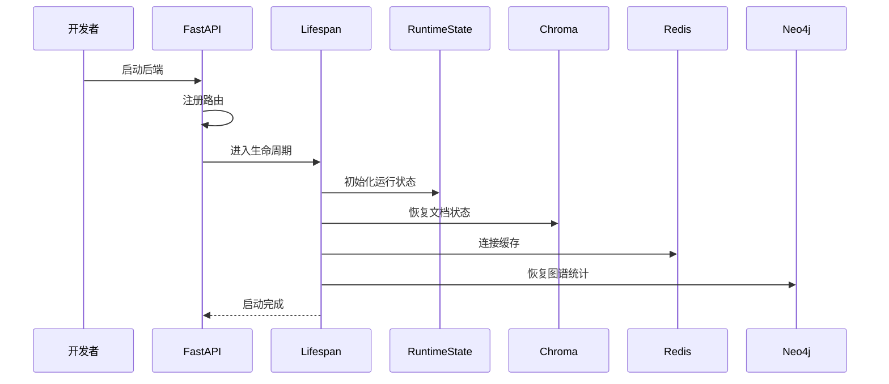
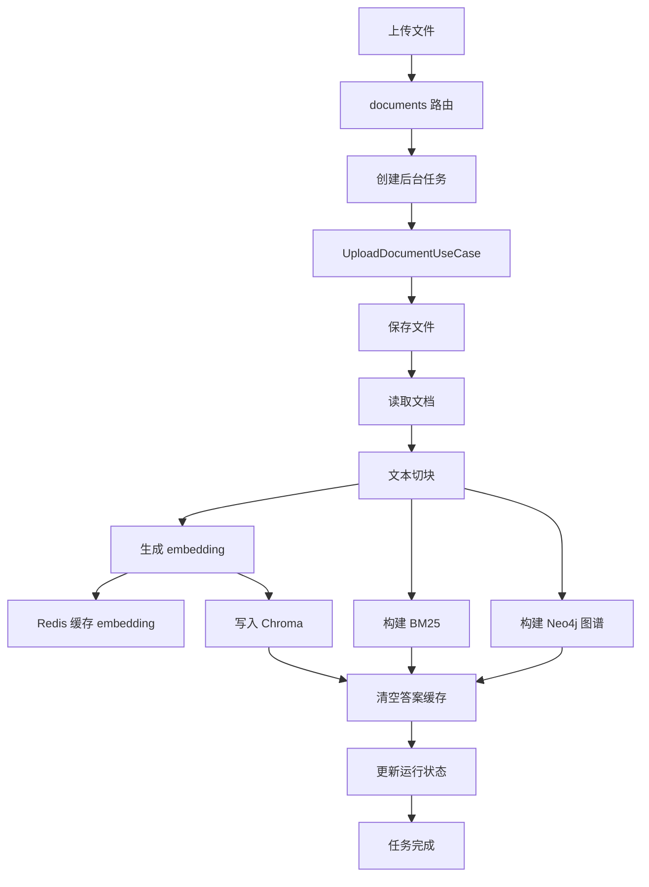
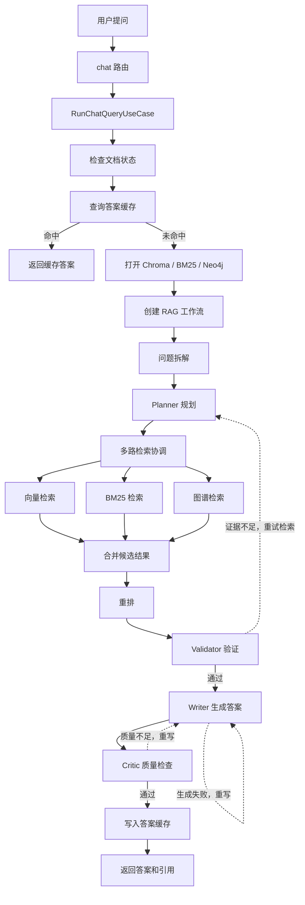
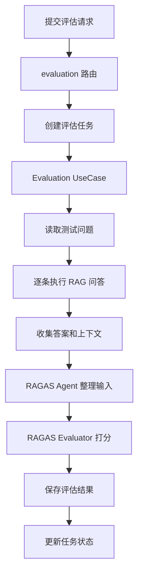
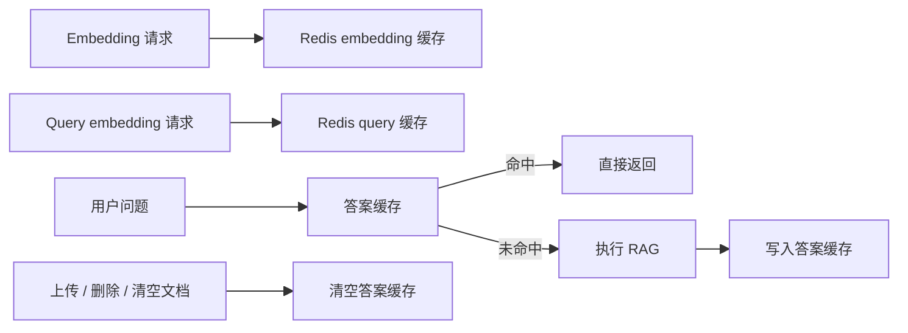

# Multi-Agent RAG 项目学习文档

这是一个基于 `FastAPI + Vue 3 + Multi-Agent RAG + ChromaDB + Neo4j + Redis` 的问答系统。它支持文档上传、向量检索、BM25 关键词检索、知识图谱检索、多智能体回答生成、Redis 缓存和 RAGAS 评估。

你可以把它理解成三条主线：

```text
上传文档 -> 切块 -> embedding -> 写入 Chroma / BM25 / Neo4j
用户提问 -> 多路检索 -> 多 Agent 协作 -> 生成答案和引用
评估任务 -> 批量问答 -> RAGAS 打分 -> 输出评估结果
```

## 技术架构

| 层级 | 技术 | 作用 |
| --- | --- | --- |
| 前端 | Vue 3 + Vite + TypeScript | Web 交互界面，负责上传文档、提问、查看任务和评估结果 |
| 后端 API | FastAPI + Uvicorn | 提供 HTTP 接口，承接前端请求 |
| 配置管理 | Pydantic Settings + `.env` | 统一读取模型、Neo4j、Redis、Chroma、路径等配置 |
| LLM | DashScope OpenAI-compatible API，<br />默认 `qwen3.6-plus` | Agent 规划、验证、写作、批判和评估 |
| 向量嵌入 | DashScope Embedding，默认 `text-embedding-v4` | 将文档切块和查询文本转换为语义向量 |
| Agent 编排 | LangChain + LangGraph | 连接多个 Agent，形成有状态 RAG 工作流 |
| 多智能体 | Planner / RetrievalCoordinator / Writer / Critic 等 | 拆解问题、规划检索、生成答案、检查质量 |
| 向量数据库 | ChromaDB | 持久化存储文档向量和 chunk 元数据 |
| 关键词检索 | rank-bm25 | 提供 BM25 精确关键词检索能力 |
| 知识图谱 | Neo4j | 存储实体和关系，支持图谱检索与统计 |
| 缓存 | Redis | 缓存 embedding、query embedding、问答结果和缓存统计 |
| NLP | spaCy | 命名实体识别和依存句法分析，用于图谱构建 |
| 评估 | RAGAS | 评估回答相关性、忠实度、上下文质量等指标 |
| 任务状态 | TaskRegistry | 跟踪上传、聊天、评估等后台任务进度 |
| 数据目录 | `data/` + `outputs/` | 保存上传文件、索引、缓存文件和评估结果 |

## 目录结构后端目录

```text
src/
  app/              FastAPI 启动、依赖装配、运行状态、后台任务、路径和环境变量
  api/              HTTP 路由和请求/响应模型
  cache/            Redis 缓存服务
  use_cases/        应用用例：聊天、文档、评估、系统状态
  agents/           多智能体角色
  workflows/        RAG 工作流工厂和 LangGraph 编排
  retrieval/        向量、BM25、图谱检索
  ingestion/        文档加载、切块、embedding
  graph/            Neo4j 图谱构建、查询、统计
  storage/          Chroma 和数据库存储
  evaluation/       RAGAS 与评估逻辑
  models/           核心数据模型
  utils/            日志、异常、引用、恢复、调试工具
  config.py         配置入口
```

## 启动流程



关键文件：

- [src/app/main.py](/D:/python/Agent/Multi-Agent-RAG/src/app/main.py)：FastAPI 应用入口。
- [src/app/lifespan.py](/D:/python/Agent/Multi-Agent-RAG/src/app/lifespan.py)：启动和关闭时的恢复逻辑。
- [src/app/dependencies.py](/D:/python/Agent/Multi-Agent-RAG/src/app/dependencies.py)：全局依赖和用例装配。
- [src/app/state.py](/D:/python/Agent/Multi-Agent-RAG/src/app/state.py)：运行时状态。
- [src/cache/redis_cache.py](/D:/python/Agent/Multi-Agent-RAG/src/cache/redis_cache.py)：Redis 缓存服务。

## 上传文件流程

接口：

```text
POST /api/documents
```



主要代码：

- [src/api/routes/documents.py](/D:/python/Agent/Multi-Agent-RAG/src/api/routes/documents.py)
- [src/use_cases/documents.py](/D:/python/Agent/Multi-Agent-RAG/src/use_cases/documents.py)
- [src/ingestion/document_loader.py](/D:/python/Agent/Multi-Agent-RAG/src/ingestion/document_loader.py)
- [src/ingestion/flat_chunker.py](/D:/python/Agent/Multi-Agent-RAG/src/ingestion/flat_chunker.py)
- [src/ingestion/embedder.py](/D:/python/Agent/Multi-Agent-RAG/src/ingestion/embedder.py)
- [src/storage/chroma_store.py](/D:/python/Agent/Multi-Agent-RAG/src/storage/chroma_store.py)
- [src/graph/build_neo4j_graph.py](/D:/python/Agent/Multi-Agent-RAG/src/graph/build_neo4j_graph.py)

## 查询问答流程

接口：

```text
POST /api/chat/messages
POST /api/chat/tasks
```



主要代码：

- [src/api/routes/chat.py](/D:/python/Agent/Multi-Agent-RAG/src/api/routes/chat.py)
- [src/use_cases/chat.py](/D:/python/Agent/Multi-Agent-RAG/src/use_cases/chat.py)
- [src/workflows/factory.py](/D:/python/Agent/Multi-Agent-RAG/src/workflows/factory.py)
- [src/workflows/complete_workflow.py](/D:/python/Agent/Multi-Agent-RAG/src/workflows/complete_workflow.py)
- [src/agents/retrieval_coordinator.py](/D:/python/Agent/Multi-Agent-RAG/src/agents/retrieval_coordinator.py)
- [src/retrieval](/D:/python/Agent/Multi-Agent-RAG/src/retrieval)

## 评估流程

接口：

```text
POST /api/evaluation/ragas
```



主要代码：

- [src/api/routes/evaluation.py](/D:/python/Agent/Multi-Agent-RAG/src/api/routes/evaluation.py)
- [src/use_cases/evaluation.py](/D:/python/Agent/Multi-Agent-RAG/src/use_cases/evaluation.py)
- [src/agents/ragas_evaluation_agent.py](/D:/python/Agent/Multi-Agent-RAG/src/agents/ragas_evaluation_agent.py)
- [src/evaluation/ragas_evaluator.py](/D:/python/Agent/Multi-Agent-RAG/src/evaluation/ragas_evaluator.py)
- [scripts/generate_test_questions.py](/D:/python/Agent/Multi-Agent-RAG/scripts/generate_test_questions.py)

## Redis 缓存流程



缓存说明：

- Redis 缓存 embedding、query embedding、问答结果和统计信息。
- 上传文档、删除文档、清空数据后，会清空答案缓存，避免旧知识库答案被复用。
- embedding 缓存不会因为文档变化主动清空，因为相同文本的向量仍然可以复用。
- Redis 不可用时，系统会记录 warning 并旁路缓存，不影响后端启动。

相关文件：

- [src/cache/redis_cache.py](/D:/python/Agent/Multi-Agent-RAG/src/cache/redis_cache.py)
- [src/ingestion/embedder.py](/D:/python/Agent/Multi-Agent-RAG/src/ingestion/embedder.py)
- [src/use_cases/chat.py](/D:/python/Agent/Multi-Agent-RAG/src/use_cases/chat.py)
- [src/use_cases/documents.py](/D:/python/Agent/Multi-Agent-RAG/src/use_cases/documents.py)

## 启动方式

### 1. 安装 Python 依赖

```bash
pip install -r requirements.txt
```

### 2. 启动基础设施

`docker-compose.yml` 当前提供 Neo4j 和 Redis：

```bash
docker compose up -d
```

默认端口：

```text
Neo4j HTTP: 7474
Neo4j Bolt: 7687
Redis: 6379
```

默认账号：

```text
Neo4j: neo4j / multirag_neo4j
Redis: redis://localhost:6379
```

### 3. 配置 `.env`

至少需要：

```env
DASHSCOPE_API_KEY=your_key
DASHSCOPE_BASE_URL=https://dashscope.aliyuncs.com/compatible-mode/v1
LLM_MODEL=qwen-plus
EMBEDDING_MODEL=text-embedding-v4
NEO4J_URI=bolt://localhost:7687
NEO4J_USER=neo4j
NEO4J_PASSWORD=multirag_neo4j
REDIS_URL=redis://localhost:6379
CACHE_ENABLED=true
CACHE_TTL=3600
```

### 4. 启动后端

推荐：

```bash
uvicorn src.app.main:app --reload
```

如果希望用模块方式启动，也可以使用：

```bash
python -m src.app.main
```

检查接口：

```text
GET /api/health
GET /api/state
GET /api/performance
```

### 5. 启动前端

```bash
cd frontend
npm run dev
```

默认前端地址：

```text
http://127.0.0.1:5173
```

## 常用接口

```text
POST   /api/documents             上传文档
DELETE /api/documents/{name}      删除文档
POST   /api/data/clear            清空数据
POST   /api/chat/messages         同步问答
POST   /api/chat/tasks            异步问答
POST   /api/evaluation/ragas      启动 RAGAS 评估
GET    /api/state                 查看系统状态
GET    /api/performance           查看性能和缓存统计
```

## 保留脚本

当前 `scripts/` 只保留一个脚本：

```bash
python scripts/generate_test_questions.py
```

用途：从已有文档和 Chroma 数据中生成 RAGAS 测试问题。

## 推荐学习顺序

1. [src/app/main.py](/D:/python/Agent/Multi-Agent-RAG/src/app/main.py)：看后端如何启动。
2. [src/app/dependencies.py](/D:/python/Agent/Multi-Agent-RAG/src/app/dependencies.py)：看依赖如何被创建和注入。
3. [src/api/routes](/D:/python/Agent/Multi-Agent-RAG/src/api/routes)：看前端请求如何进入后端。
4. [src/use_cases](/D:/python/Agent/Multi-Agent-RAG/src/use_cases)：看每个用户意图如何被执行。
5. [src/cache/redis_cache.py](/D:/python/Agent/Multi-Agent-RAG/src/cache/redis_cache.py)：看 Redis 缓存如何工作。
6. [src/workflows](/D:/python/Agent/Multi-Agent-RAG/src/workflows)：看多 Agent RAG 如何编排。
7. [src/agents](/D:/python/Agent/Multi-Agent-RAG/src/agents)：看各个 Agent 的具体职责。

## 常用验证命令

```bash
pytest tests -q
python -c "import src.app.main as m; print(type(m.app).__name__)"
python -c "from src.app.dependencies import get_runtime_state; print(type(get_runtime_state()).__name__)"
python -c "from src.workflows.factory import create_full_rag_workflow; print(create_full_rag_workflow.__name__)"
python -m src.graph.build_neo4j_graph --help
```
